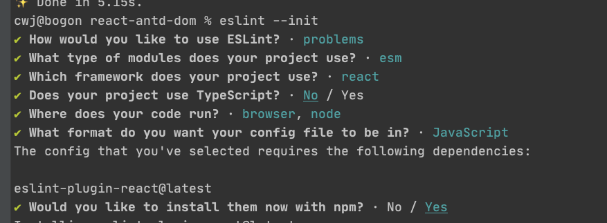

##启动
### `yarn run start:dev`
### `yarn run start:pro`
##打包
### `yarn run build:dev`
### `yarn run build:pro`

#webpack 配置 
### react-app-rewired customize-cra 取代 react-scripts，可以扩展 webpack 配置，类似 vue.config.js
    yarn add -D customize-cra react-app-rewired

    // package.json
    "scripts": {
        "start": "react-app-rewired start",
        "build": "react-app-rewired build",
        "test": "react-app-rewired test --env=jsdom",
        "eject": "react-scripts eject"
     }
    
    // 根目录创建 config-overrides.js
    // 安装compression-webpack-plugin 压缩js为gzip
    yarn add compression-webpack-plugin -D
    
    // 安装 lib-flexible 设置跟元素的font-size
    yarn add lib-flexible -D
    
    // 安装 babel-plugin-import 按需引入ant
    yarn add babel-plugin-import -D
    //
    yarn add postcss-pxtorem --save
    
    
    const path = require('path');
    const {
      override,
      fixBabelImports,
      addWebpackAlias,
      overrideDevServer,
      addPostcssPlugins
    } = require('customize-cra'); // show https://github.com/arackaf/customize-cra
    const CompressionWebpackPlugin = require('compression-webpack-plugin');
    
    function resolve(dir) {
      return path.join(__dirname, '.', dir)
    }
    
    const addCustomize = () => config => {
      if (process.env.NODE_ENV === 'production') {
        // 关闭sourceMap
        config.devtool = false;
        // 配置打包后的文件位置
        // config.output.path = resolve('dist');
        // config.output.publicPath = './';
        // 添加js打包gzip配置
        config.plugins.push(
          new CompressionWebpackPlugin({
            test: /\.js$|\.css$/,
            threshold: 1024,
          }),
        )
      }
      return config;
    }
    //  本地代理
    // const devServerConfig = () => config => {
    //   return {
    //     ...config,
    //     proxy: {
    //       '/api': {
    //         target: 'xxx',
    //         changeOrigin: true,
    //         pathRewrite: {
    //           '^/api': '/api',
    //         },
    //       }
    //     }
    //   }
    // }
    
    module.exports = {
      webpack: override(
        // 配置antd 的按需引入
        fixBabelImports('import', {
          libraryName: 'antd',
          style: 'css'
        }),
        // 配置路径访问快捷键 @/xxx
        addWebpackAlias({
          '@': resolve('src'),
        }),
        // postCss 自动将px转为rem 需要配合 lib-flexible 使用
        addPostcssPlugins([
          require('postcss-pxtorem')({ rootValue: 75, propList: ['*'], minPixelValue: 2, selectorBlackList: ['am-'] })
        ]),
        // 压缩js等
        addCustomize()
      ),
      // 本地启动配置，可以设置代理
      devServer: overrideDevServer(
        // devServerConfig()
      )
    };
#配置多环境
    //安装dotenv-cli 
    yarn add dotenv-cli -D
    
    //修改 package.json
    "scripts": {
        "start:dev": "dotenv -e .env.dev react-app-rewired start",
        "start:pro": "dotenv -e .env.pro react-app-rewired start",
        ...
      }
      
      //使用
      process.env.REACT_APP_MODE
#安装ellint
    yarn add eslint -D
    yarn add -D eslint-config-airbnb eslint-plugin-jsx-a11y eslint-plugin-import eslint-plugin-react babel-eslint eslint-loader eslint-plugin-babel
    eslint --init //进入问题配置页面  Airbnb规则
    安装完成后 删除  package-lock.json   node_modules  重新拉取依赖  yarn install

###.eslintrc.js
    0 不开启  1警告  2 强制使用
       "rules": {
           "spaced-comment": 2,// 注释风格要不要有空格什么的
           "space-before-blocks": 2,  // if function等的大括号之前需要有空格
           "space-infix-ops": 2,
           "space-before-function-paren": [2, "always"], // 强制在 function的左括号之前使用一致的空格
           "semi": 2, // 强制使用分号
           "no-irregular-whitespace": 2, // 不规则的空白不允许
           "no-trailing-spaces": 2, // 一行结束后面有空格就发出警告
           "no-underscore-dangle": 2, // 标识符不能以_开头或结尾
           "no-const-assign": 2, // 禁止修改const声明的变量
           "no-dupe-keys": 2, // 在创建对象字面量时不允许键重复
           "no-duplicate-case": 2, // switch中的case标签不能重复
           "no-dupe-args": 2, // 函数参数不能重复
           "no-empty": 2, // 块语句中的内容不能为空
           "no-func-assign": 2, // 禁止重复的函数声明
           "no-undef": 2, // 不能有未定义的变量
           "no-use-before-define": 2, // 未定义前不能使用
           "camelcase": 2, // 强制驼峰法命名
           "react/jsx-no-duplicate-props": 2, // 防止在JSX中重复的props
           "react/jsx-no-undef": 2, // 在JSX中禁止未声明的变量
           "react/no-danger": 2, // 防止使用危险的JSX属性
           "react/no-multi-comp": 2, // 防止每个文件有多个组件定义
           "react/no-unknown-property": 2, // 防止使用未知的DOM属性
           "react/prefer-es6-class": 2, // 为React组件强制执行ES5或ES6类
           "react/no-array-index-key": 0, // 防止在数组中遍历中使用数组key做索引
           "react/no-deprecated": 2, // 不使用弃用的方法
           "react/jsx-equals-spacing": 2, // 在JSX属性中强制或禁止等号周围的空格
           "no-unreachable": 2, // 不能有无法执行的代码
           "comma-dangle": 2, // 对象字面量项尾不能有逗号
           "no-var": 2 // 不允许使用 var
       }
